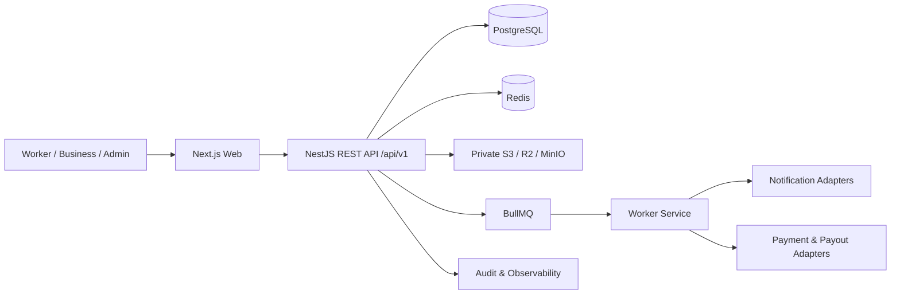

# Arsitektur Target

Web memakai Server Components secara default. API memisahkan controller, application service, domain policy, dan repository. Status finansial dan pekerjaan berubah hanya melalui service transaksional. Worker mengonsumsi outbox/queue untuk proses yang dapat diulang.

## Boundary utama

- Identity: user, session, device, consent.
- Workforce: worker profile, skill, availability, verification.
- Business: business, member, verification, subscription.
- Marketplace: job, application, assignment, attendance, evidence, review.
- Money movement: invoice, transaction, ledger entry, payout, refund, reconciliation.
- Trust: dispute, report, risk flag, audit log.
