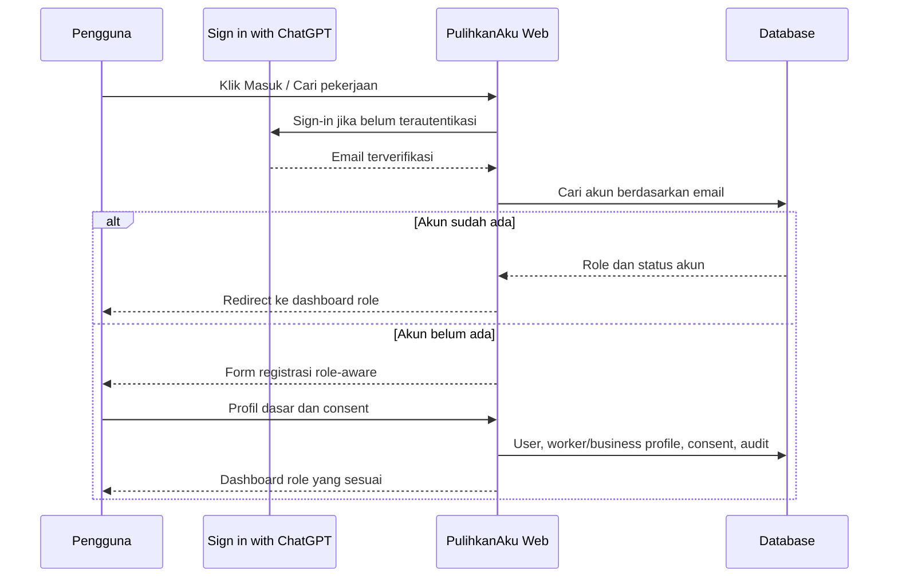

# Authentication & Registration

Hosted Sites menggunakan dispatch-owned Sign in with ChatGPT untuk membuktikan identitas email. PulihkanAku tidak menerima role dari client atau identity provider; role, status akun, ownership, dan resource permission selalu dibaca dari database.

## Aturan

- Registrasi publik hanya dapat memilih `WORKER` atau `BUSINESS_OWNER`.
- Role admin tidak tersedia pada form publik.
- Marketing consent terpisah dan opsional.
- Terms dan privacy consent disimpan dengan versi.
- Nomor Indonesia dinormalisasi ke E.164 dan harus unik.
- Worker tidak dapat membuka dashboard business; business tidak dapat membuka dashboard worker.
- Akun yang belum terdaftar diarahkan ke registrasi, bukan langsung ke dashboard.
- Header identitas development dinonaktifkan ketika `NODE_ENV=production`.

Untuk deployment mandiri di `pulihkanaku.com`, adapter OTP WhatsApp/telepon dan email magic-link akan mengganti identity adapter tanpa mengubah database role atau authorization policy.
