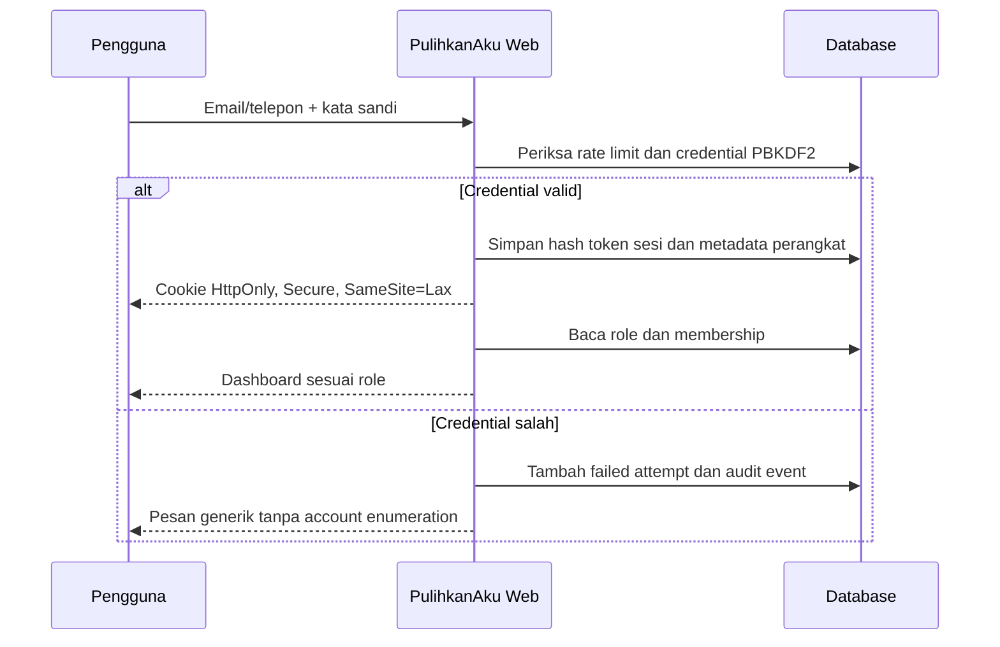

# Authentication & Sessions

PulihkanAku menggunakan autentikasi milik aplikasi sendiri. Pengguna masuk menggunakan email atau nomor telepon dan kata sandi; tidak ada ketergantungan pada akun GPT atau header identitas eksternal.

## Kontrol keamanan

- Kata sandi di-hash menggunakan PBKDF2-SHA256 dengan salt acak dan 310.000 iterasi.
- Token sesi acak 256-bit; database hanya menyimpan hash token.
- Cookie sesi bersifat `HttpOnly`, `Secure` pada production, dan `SameSite=Lax`.
- Percobaan dibatasi berdasarkan kombinasi IP dan identifier.
- Akun dikunci 15 menit setelah lima kata sandi salah.
- Pengguna dapat melihat perangkat aktif, keluar dari satu sesi, atau mencabut semua sesi.
- Request mutasi dengan `Origin` lintas-origin ditolak.
- Role tetap dibaca dari database; role admin tidak tersedia pada registrasi publik.
- Membership bisnis disimpan terpisah dari akun pengguna.

OTP dapat ditambahkan sebagai verifikasi kontak atau pemulihan akun melalui notification adapter tanpa mengganti model session.
