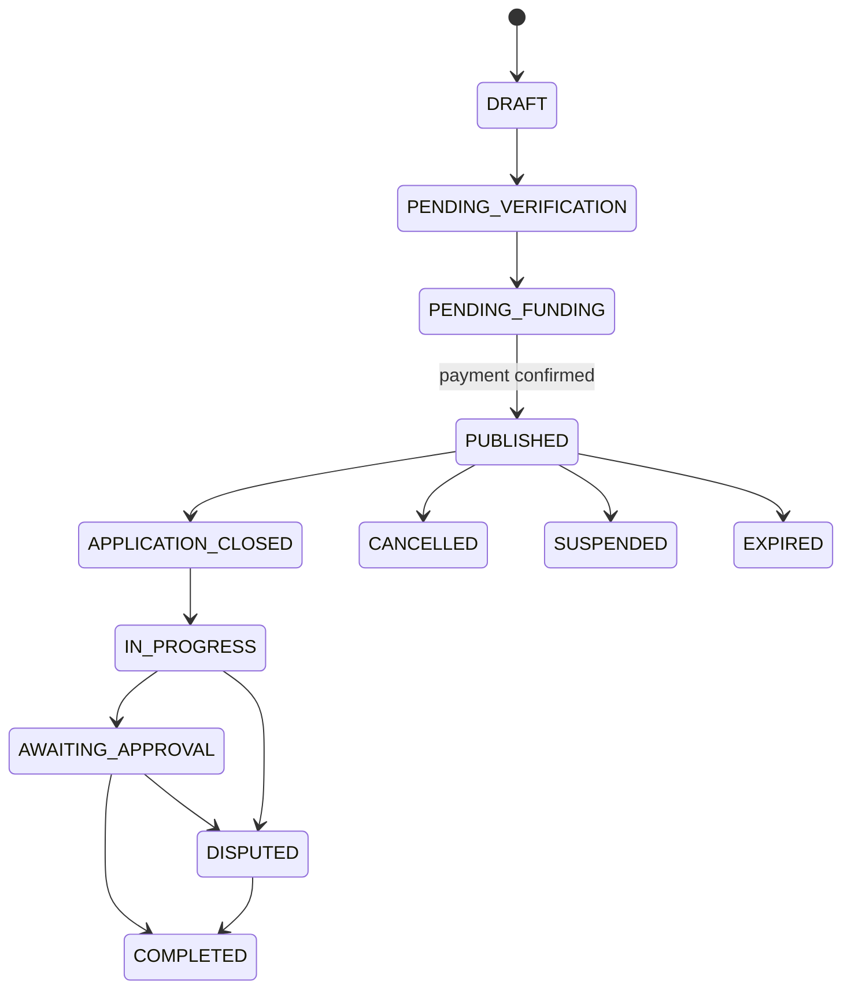

# Job State Machine

Setiap command memeriksa role, ownership, status bisnis/worker, versi optimistic lock, dan idempotency key bila berdampak finansial. Transisi ilegal mengembalikan `409 JOB_INVALID_TRANSITION`; transisi berhasil menulis audit event pada transaksi yang sama.
