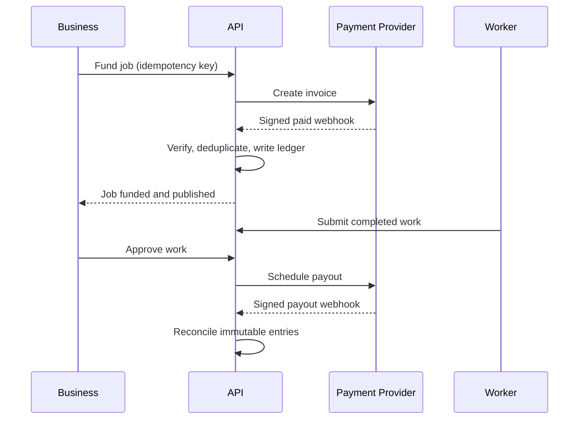

# Payment & Payout Flow

```mermaid
sequenceDiagram
  participant B as Business
  participant API
  participant PG as Payment Provider
  participant W as Worker
  B->>API: Fund job (idempotency key)
  API->>PG: Create invoice
  PG-->>API: Signed paid webhook
  API->>API: Verify, deduplicate, write ledger
  API-->>B: Job funded and published
  W->>API: Submit completed work
  B->>API: Approve work
  API->>PG: Schedule payout
  PG-->>API: Signed payout webhook
  API->>API: Reconcile immutable entries
```

Ledger types: `JOB_FUNDING`, `PLATFORM_FEE`, `WORKER_PAYABLE`, `PAYOUT`, `REFUND`, `ADJUSTMENT`, `REVERSAL`.
