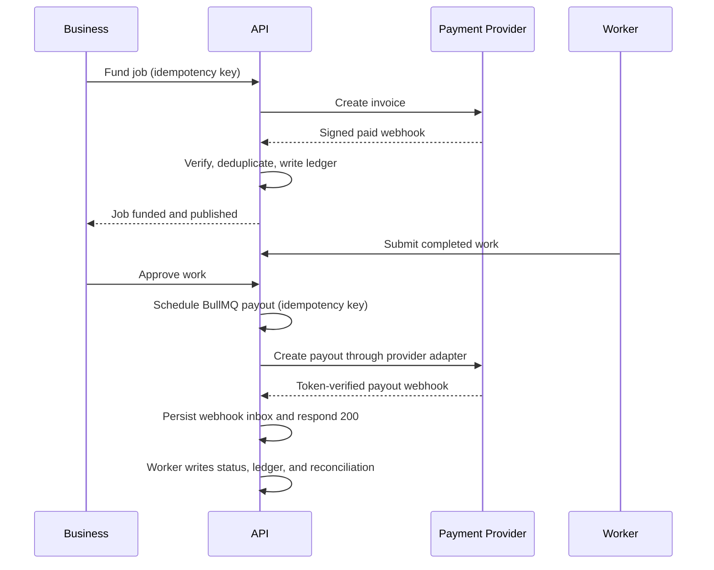

# Payment & Payout Flow

Ledger types: `JOB_FUNDING`, `PLATFORM_FEE`, `WORKER_PAYABLE`, `PAYOUT`, `REFUND`, `ADJUSTMENT`, `REVERSAL`.

Adapter Xendit memakai Payouts v2 untuk kanal domestik Indonesia (`ID_<BANK>`), Basic secret-key authentication, dan idempotency key. Error sementara masuk exponential retry maksimal enam percobaan; error validasi terminal menjadi `FAILED`. Webhook dideduplikasi berdasarkan provider/event ID. Ketidaksesuaian nominal atau status masuk `REVIEW_REQUIRED` dan diselesaikan finance/operations admin melalui `/admin/reconciliation` dengan alasan yang diaudit.
